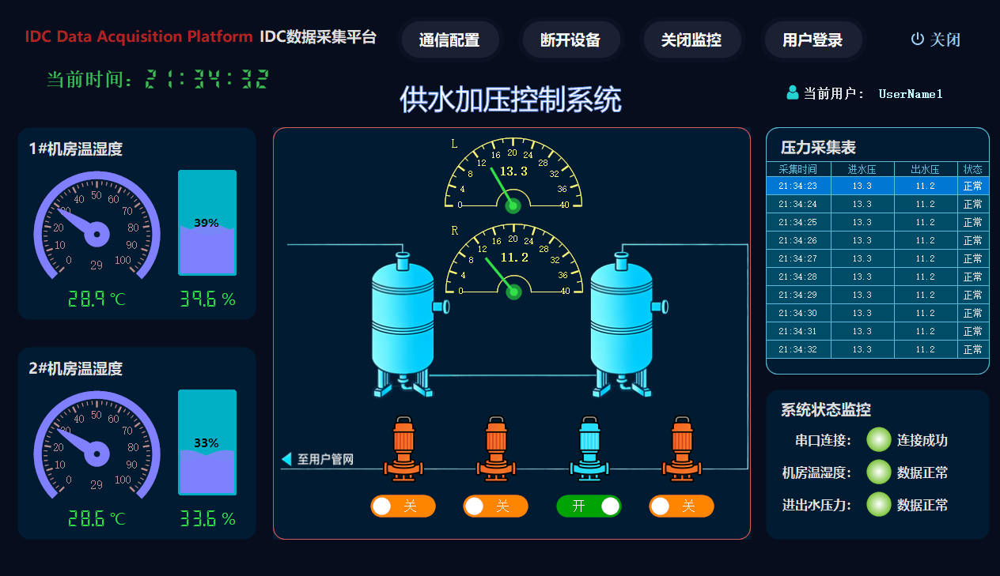

# 工业设备监控上位机

基于.NET Framework 4.8 + WinForm开发的工业设备监控上位机，通过Modbus RTU协议实时采集设备的进出压力值、两组温湿度数据，结合HZHControl和SunnyUI控件库实现美观且易用的人机交互界面。

## 项目特性
- **数据采集**：基于NModbusRTU库实现Modbus RTU协议通信，稳定读取工业设备的进出压力、两组温湿度数据；
- **实时监控**：数据实时刷新展示，直观反映设备运行状态；
- **界面美化**：整合HZHControl、SunnyUI控件库，打造符合工业场景的美观、易用界面；
- **兼容性**：基于.NET Framework 4.8开发，兼容Windows主流操作系统（Win7/Win10/Win11）。

## 技术栈
| 技术/框架         | 版本/说明                  |
|--------------------|----------------------------|
| 开发框架           | .NET Framework 4.8         |
| 开发平台           | WinForm (Windows 窗体)     |
| 通信协议库         | NModbusRTU (Modbus RTU通信)|
| UI控件库           | HZHControl + SunnyUI       |
| 开发工具           | Visual Studio 2022         |

## 功能说明
### 核心功能
1. **设备通信**：
   - 支持Modbus RTU串口参数配置（波特率、数据位、停止位、校验位等）；
   - 自动重连机制，保证通信稳定性；
   - 通信状态实时显示（连接/断开/异常）。
2. **数据监控**：
   - 实时显示设备进水压力、出水压力数值；
   - 实时显示两组温湿度（温度+湿度）数据；
   - 数值异常提示（可选：超阈值标红/弹窗提醒）。
3. **基础交互**：
   - 手动触发数据刷新/自动定时刷新；
   - 通信日志查看（连接日志、数据采集日志、异常日志）；
   - 界面布局自适应，支持窗口缩放。

## 快速开始
### 环境要求
- 操作系统：Windows 7/10/11（32/64位）；
- 开发/运行环境：安装.NET Framework 4.8 运行时（[下载地址](https://dotnet.microsoft.com/zh-cn/download/dotnet-framework/net48)）；
- 硬件：串口（RS232/RS485）或USB转串口设备（用于连接工业设备）。

### 编译运行
1. 克隆/下载项目源代码至本地；
2. 使用Visual Studio 2019/2022打开项目解决方案（.sln文件）；
3. 还原NuGet包（自动还原NModbusRTU、HZHControl、SunnyUI相关依赖）；
4. 确认项目目标框架为.NET Framework 4.8（右键项目→属性→应用程序→目标框架）；
5. 编译并运行（F5）。

### 配置说明
1. 打开上位机后，在“通信设置”模块配置串口参数（端口号、波特率、校验位等），需与工业设备端一致；
2. 配置数据采集地址（Modbus寄存器地址），对应进出压力、温湿度数据的存储地址；
3. 配置采集频率（如1秒/次），点击“连接设备”即可开始实时采集。
